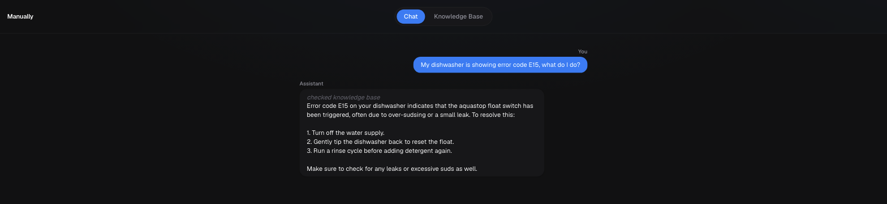
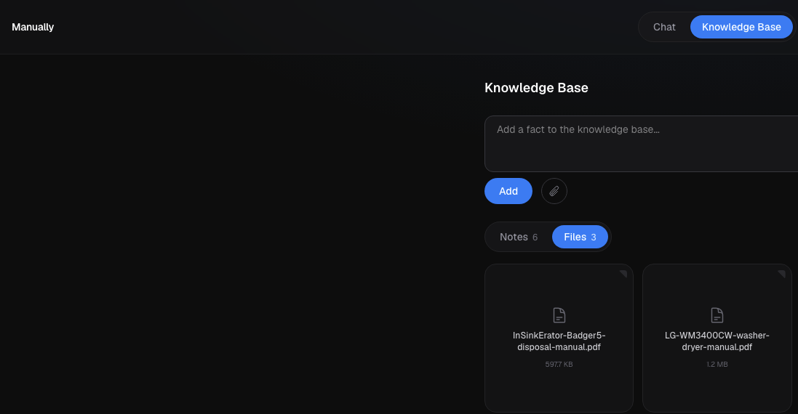

<h1 align="center">Manually</h1>

<p align="center">Chat with your appliance manuals, so you don't have to read them manually.</p>

<p align="center">
  
  
  
</p>

<br />

## Why this exists

I moved into a new condo and every appliance came with a manual I was never going to read: a dishwasher that throws cryptic error codes, a thermostat with a filter reminder I could never find, an in-unit washer/dryer combo with its own reset ritual. The manuals themselves were sitting in a kitchen drawer as un-searchable PDFs.

So instead of digging through them, I built something to digest them for me. Upload the PDFs (or just type in what you know), and ask questions in plain language. It only answers from what you've actually given it — no guessing, no made-up troubleshooting steps.

<br />

## How it works

- **Ask anything about your stuff.** "My dishwasher is showing error code E15, what do I do?" gets answered from the manual you uploaded, not a generic guess.
- **Teach it as you go.** Didn't feel like uploading a whole manual? Just type the one fact you needed ("the thermostat filter reminder resets from Settings > Reminders").
- **Grounded, not hallucinated.** If it isn't in your knowledge base, the agent says so instead of making something up.
- **PDFs in, structured knowledge out.** Drop in a manual and it's chunked, embedded, and made searchable automatically.

<p align="center">
  
</p>

<p align="center">
  
</p>

<br />

## Stack

Built entirely on the Vercel platform:

- **[Next.js](https://nextjs.org)** (App Router) for the app itself
- **[AI SDK](https://ai-sdk.dev)** for the agent loop, tool calling, and chat streaming
- **[AI Gateway](https://vercel.com/docs/ai-gateway)** for model access (`openai/gpt-4o-mini` for chat, `cohere/embed-v4.0` for embeddings) — no provider keys to manage
- **[Neon Postgres](https://neon.tech)** with `pgvector` for storing and searching embeddings
- **[Vercel Blob](https://vercel.com/docs/storage/vercel-blob)** for the original uploaded PDFs
- **Drizzle ORM** for schema and queries

<br />

## Running it locally

```bash
npm install
npm run dev
```

You'll need a Postgres database with `pgvector` enabled and Blob storage — the fastest way to get both is `vercel link` on a project that has the [Neon](https://vercel.com/marketplace/neon) and Blob integrations installed, then:

```bash
vercel env pull .env.local
npm run db:migrate
```

Open [http://localhost:3000](http://localhost:3000) and start asking it things.

<br />

## Deploying your own

```bash
vercel deploy --prod
```

That's it — the project already declares its env vars, so as long as Neon and Blob are provisioned on the linked Vercel project, this just works.

<br />

## License

[MIT](LICENSE)
